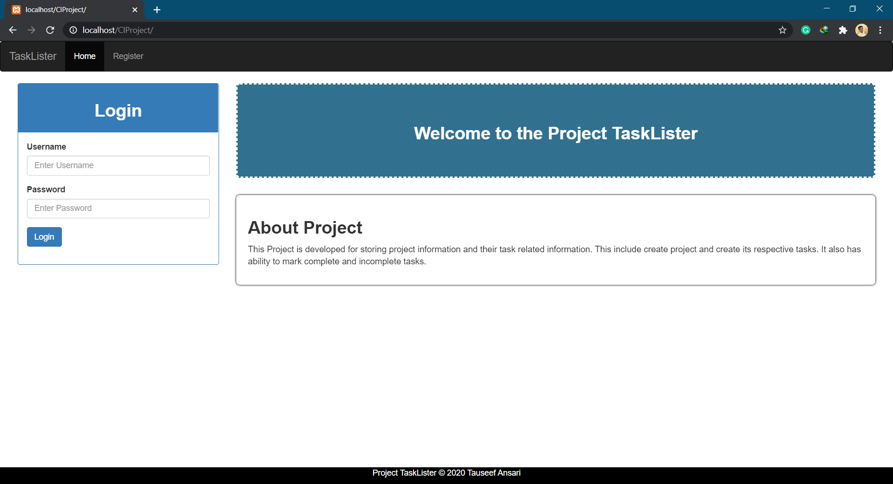
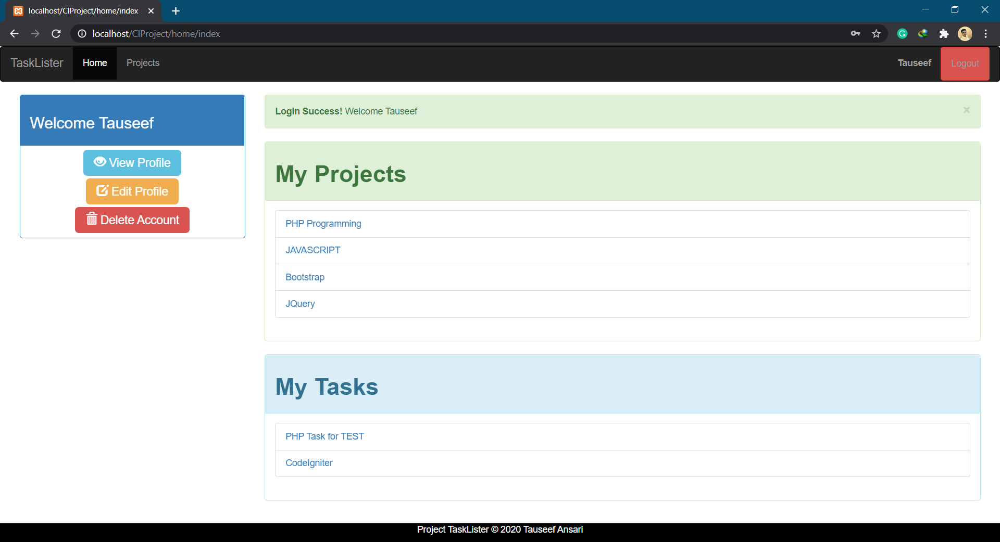
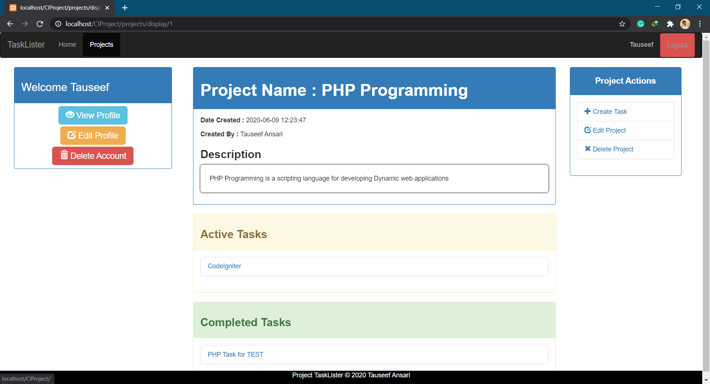
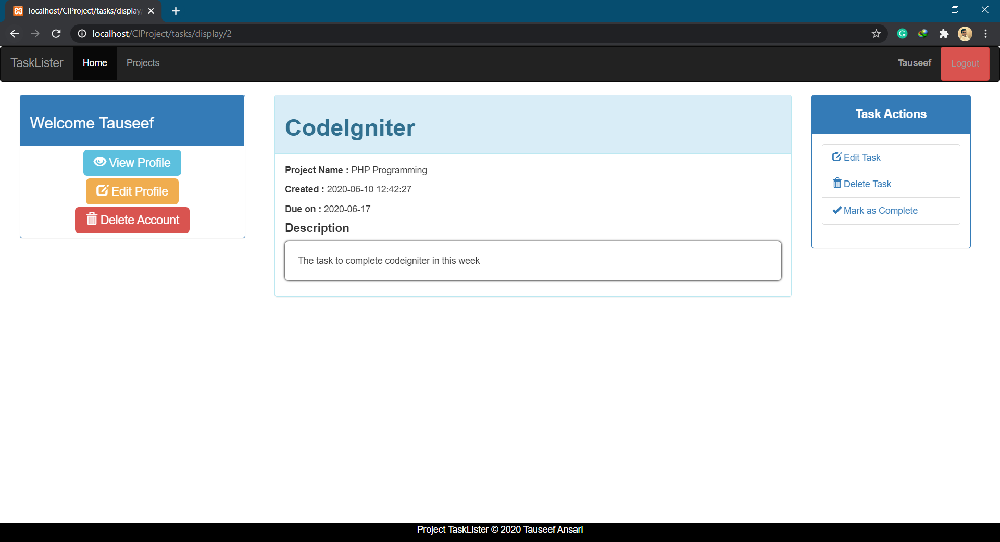

# CodeIgniter Practice Project
> Project and Task of projects can be created and updated with completion status of tasks

## Snapshot of the project

## Contributing

1. Fork [CodeIgniter Project](https://github.com/tauseefansari/CodeIgniter-Practice-Project)
2. Create your feature branch (`git checkout -b feature/fooBar`)
3. Commit your changes (`git commit -am 'Add some fooBar'`)
4. Push to the branch (`git push origin feature/fooBar`)
5. Create a new Pull Request
